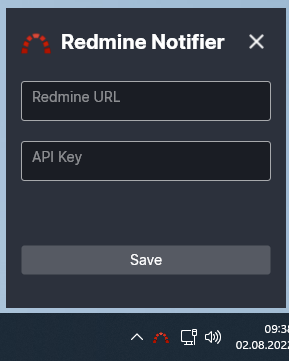

# Redmine issue notifier
### Simple app showing a notification when a new issue is opened in your Redmine.
###
###

Written in C# using the Avalonia UI framework.
Only works on Windows.

## Installation and usage

1. Download executable from [release page](https://github.com/JacobDeuchert/redmine-issue-notifier/releases).
2. Add executable to your startup folder (e.g. C:\Users\YourUserName\AppData\Roaming\Microsoft\Windows\Start Menu\Programs\Startup).
3. Run executable
4. Open application from tray icon
5. Provide url and API key to the application.
